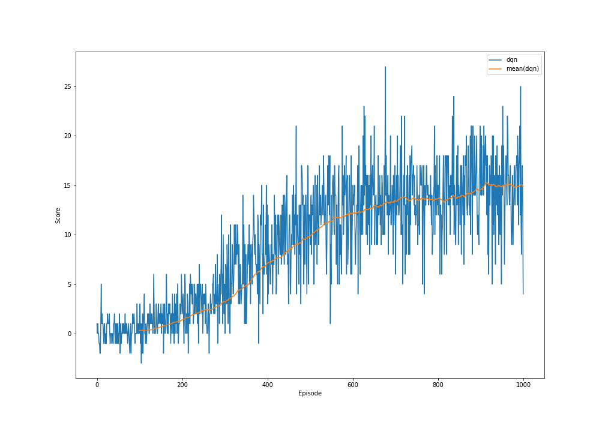
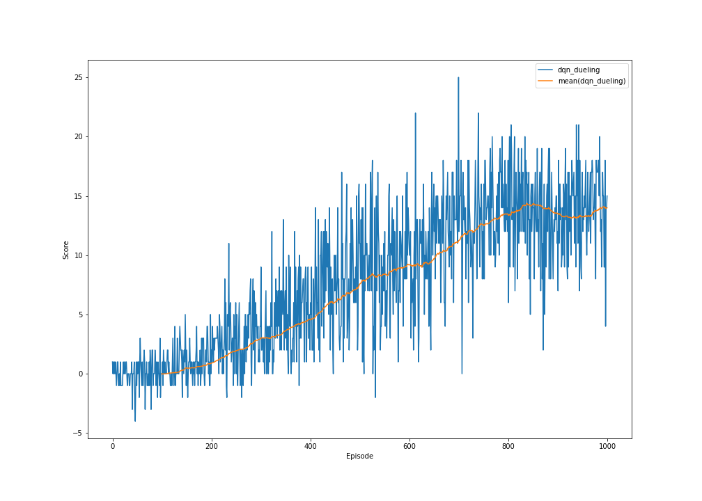
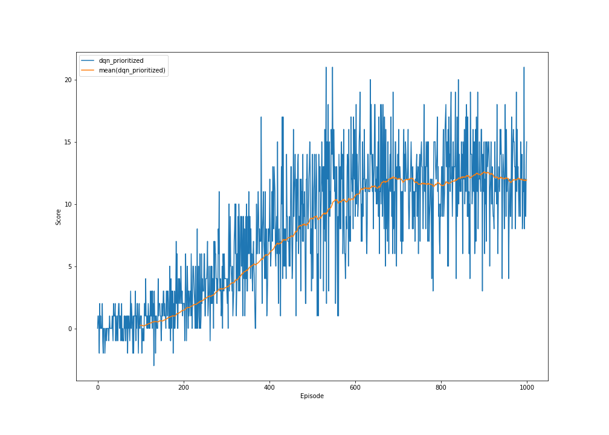
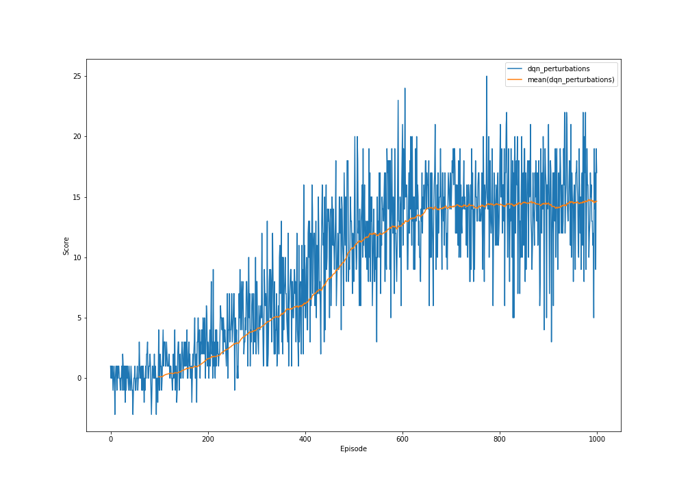
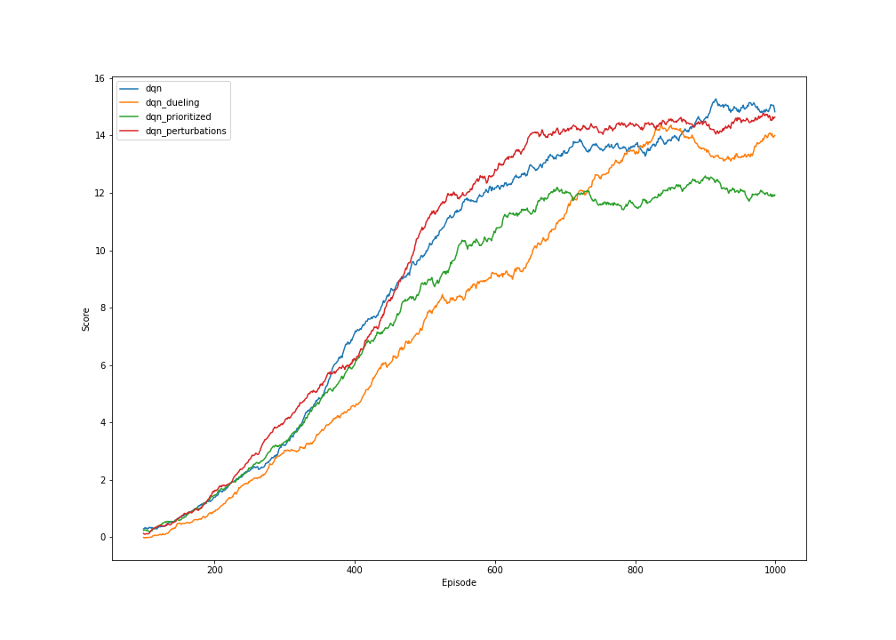

# Report
by Luca Schweri, 2022

## Learning Algorithms

### Double Q-Learning DQN

#### Architecture

The following list describes the layers of the network:
1) Linear(37 -> 512)
2) Linear(512 -> 128)
3) Linear(128 -> 32)
4) Linear(32 -> 4)

The implementation of the architecture can be found in [dqn.py](networks/dqn.py).

#### Hyperparameters

- Number of Episodes for Training: 1000
- Learning Rate: 0.0005
- Replay Buffer Size: 100000
- Batch Size: 64
- Experience Replay Learning Every ? Steps: 4
- Discount Factor: 0.99
- Epsilon: 1.0 --(over 500 episodes)--> 0.1 --(over 500 episodes)--> 0.05 (for both linear decay was used)
- Exponential Moving Average Factor for Target Network Updates: 0.001
- State Perturbation: 0
And it uses double Q-learning. The double Q-learning method was introduced by [van Hasselt et al.](https://arxiv.org/pdf/1509.06461)

The configurations for this approach can be found in [config.json](data/dqn/config.json).

#### Results

The plots and saved network parameters can be found in [dqn](data/dqn).

### Dueling Network DQN

#### Architecture

The following list describes the layers of the network:
1) Linear(37 -> 512)
2) Linear(512 -> 128)
After the second layer the network is split into a network for the state value and a network for the advantage values. The branch for the state value:
3) Linear(128 -> 32)
4) Linear(32 -> 1)
And the branch for the advantage values:
3) Linear(128 -> 32)
4) Linear(32 -> 4)
The ouptut of both is then added to get the action values.
This method was introduced by [Wang et al.](https://arxiv.org/pdf/1511.06581)

The implementation of the architecture can be found in [dueling_dqn.py](networks/dueling_dqn.py).

#### Hyperparameters

It uses the same hyperparameters as Double Q-Learning DQN.

The configurations for this approach can be found in [config.json](data/dqn_dueling/config.json).

#### Results

The plots and saved network parameters can be found in [dqn_dueling](data/dqn_dueling).

### Prioritized Experience Replay DQN

#### Architecture

It uses the same architecture as Double Q-Learning DQN.

The implementation of the architecture can be found in [dqn.py](networks/dqn.py).

#### Hyperparameters

It uses the same hyperparameters as Double Q-Learning DQN except that it additionally uses prioritized experience replay as introduced by [Schaul et al.](https://arxiv.org/pdf/1511.05952.pdf). Prioritized experience replay uses the following additional parameters:
- alpha: 0.8
- beta: 0.8
- epsilon: 0.001

The configurations for this approach can be found in [config.json](data/dqn_prioritized/config.json).

#### Results

The plots and saved network parameters can be found in [dqn_prioritized](data/dqn_prioritized).

### State Perturbations DQN

#### Architecture

It uses the same architecture as Double Q-Learning DQN.

The implementation of the architecture can be found in [dqn.py](networks/dqn.py).

#### Hyperparameters

It uses the same hyperparameters as Double Q-Learning DQN except that it uses random state perturbations between [-0.005, 0.005] in the experience replay.

The configurations for this approach can be found in [config.json](data/dqn_perturbations/config.json).

#### Results

The plots and saved network parameters can be found in [dqn_perturbations](data/dqn_perturbations).

## Comparison

On the following image you can compare the four approaches over 1000 episodes. The plot shows the 100 episodes moving average:
- **dqn**: Double Q-Learning DQN
- **dqn_dueling**: Dueling Network DQN
- **dqn_prioritized**: Prioritized Experience Replay DQN
- **dqn_perturbations**: State Perturbations DQN

## Ideas

The following is list of possible further improvements of the agent:
- **Optimistic Initialization**: For the not deep reinforcment learning methods it helps to initalize the Q-table with optimistic values to support exploration in the beginning. I have tried one possible approach but it didn't work well.
- **Adversarial Training**: I have tried using random perrturbation of the states in the experience replay to optimize the robustness of the agent's network. A more effective way to do this is to increase the robustness is to use adversarial training.
- **State Normalization**: If we would have some more information about the state, one could normalize the state before using it as input for the network. This might help.
- **M-th Frame Prediction**: Do action prediction every M-th frame instead of every frame. This might help because the agent's replay buffer would store more states with higher difference between each other.
- **Next State Prediction**: Additional to the action values the network should predict the next state of each action. This might help in finding better network parameters because the next state is correlated with the action values.
- **Knowledge of Environment**: One can use the knowledge of the environment. For example I have seen that some times the agent gets stuck by always alternating between the actions "turn left" and "turn right", one can restirct the agent from doing this. 
- **Different Network**: I have used a very easy network. Many different network architectures can be tested.
- **Further Hyperparameter Tuning**: I did some hyperparameter tuning but there is still some room for improvements.